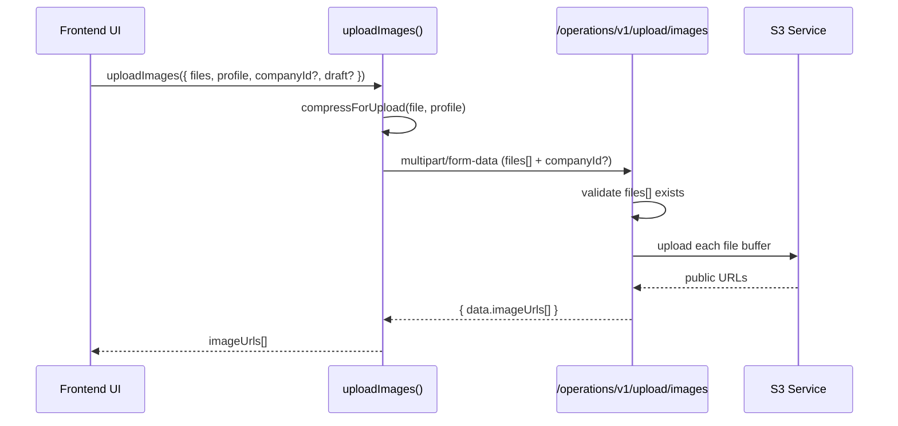
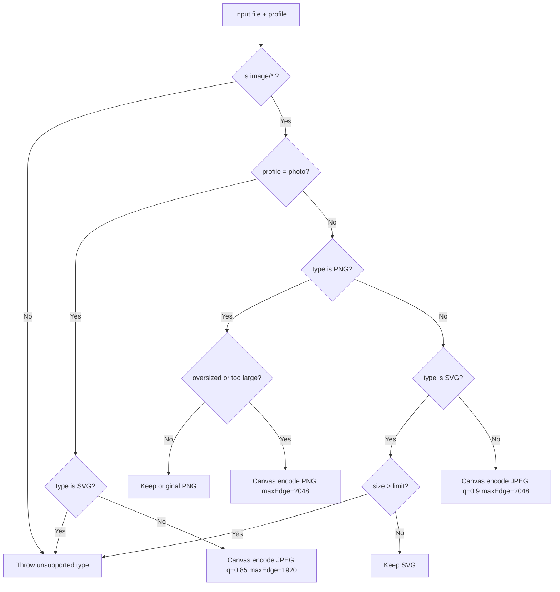

# Deterministic Upload + Collection Builder Alignment

Date: 2026-03-06
Context: Pre-alpha alignment across `api`, `admin`, `client`, and `warehouse`.

## 1) Outcome Summary

This implementation hard-aligns image uploads and collection builder behavior with deterministic runtime rules:

- Upload contract is strict: multipart key is `files` only.
- All 3 frontends now use a unified upload utility and same compression policy.
- Runtime no longer uses upload field fallback behavior.
- Asset image rendering is standardized to `AssetImage[]` object shape usage (`{ url, note? }`).
- Added DB migration to normalize legacy JSON rows (`assets.images`, `asset_versions.snapshot.images`).
- Warehouse collection builder grid behavior now follows the requested placement pattern and auto-scroll behavior.
- Predeploy checks pass in all 4 repos.

---

## 2) API Upload Contract Hardening

### Contract
- Endpoint unchanged: `POST /operations/v1/upload/images`
- Accepted multipart field: `files` (array)
- Invalid/missing payload receives explicit 400

### Changed
- `api/src/app/middleware/upload.ts`
  - multer `fields` accepts only `name: "files"`
- `api/src/app/modules/upload/upload.controller.ts`
  - reads only `req.files.files`
  - explicit error if no file entries

### Upload Sequence



---

## 3) Unified Frontend Upload Pattern

Implemented in each frontend repo:

- `src/lib/utils/upload-images.ts`
  - `compressForUpload(file, profile)`
  - `uploadImages({ files, companyId?, draft?, profile })`

### Compression Decision Flow



### Deterministic Request Shape
- All callsites append: `formData.append("files", file)`
- No callsite uses `images` key
- No manual multipart boundary injection

### API Client Behavior
- `apiClient` interceptors in admin/client/warehouse remove JSON content-type for `FormData` payloads.

---

## 4) Upload Callsites Refactor Coverage

Image upload callsites were rerouted to the unified utility in all three frontends, including:

- Asset create/edit flows
- Collection create/edit flows
- Condition/damage image uploads
- Inbound/scan photo capture strips
- Order-related truck/scan image uploads routed through upload endpoint
- Company logo uploads (using `logo` profile)

Result: same upload/compression behavior regardless of frontend entry point.

---

## 5) Asset Image Shape Standardization + Migration

### Canonical Runtime Shape
- Asset image arrays are treated as object arrays:
  - `[{ "url": "...", "note": "..."? }]`

### Migration Added
- `api/drizzle/0022_normalize_asset_images_shape.sql`
- `api/drizzle/meta/0022_snapshot.json`
- `api/drizzle/meta/_journal.json` updated

### Migration Logic
- Normalizes `assets.images`
  - converts string entries to `{url}` objects
  - preserves existing object entries with `url`
  - trims invalid/empty values
- Normalizes `asset_versions.snapshot.images` similarly
- Idempotent data normalization only (no destructive schema changes)

### Normalization Flow

```mermaid
flowchart LR
    A[assets.images / snapshot.images] --> B{element type}
    B -- object with url --> C[normalize url + optional note]
    B -- string URL --> D[convert to {url}]
    B -- invalid/empty --> E[drop element]
    C --> F[jsonb_agg normalized array]
    D --> F
    E --> F
    F --> G[update row only if DISTINCT]
```

---

## 6) Collection Builder Behavior (Warehouse)

File:
- `warehouse/src/app/(admin)/collections/builder/[id]/page.tsx`

### Implemented Behavior
- Empty state: centered single plus card
- Non-empty: 2-column grid with deterministic plus placement
- Even asset count: inserts left spacer so plus sits bottom-right in new row
- Odd asset count: plus sits right of last asset
- Viewport capped to ~2 rows (`max-h` + `overflow-y-auto`)
- On load/return and asset count change: auto-scroll to bottom so plus is visible

### Placement Progression

```text
0 assets:
[   PLUS   ]   (centered)

1 asset:
[Asset1][ PLUS ]

2 assets:
[Asset1][Asset2]
[      ][ PLUS ]

3 assets:
[Asset1][Asset2]
[Asset3][ PLUS ]

4 assets:
[Asset1][Asset2]
[Asset3][Asset4]
[      ][ PLUS ]  (below viewport when >2 rows, scrollable)
```

---

## 7) Image Rendering Fixes (Asset vs Collection)

Asset renderers were corrected to use `asset.images[0]?.url` (object shape) where applicable.
Collection-level image arrays remain URL string arrays and were left unchanged intentionally.

---

## 8) Verification and Deployment Readiness

Executed and passed:

- `api`: `bun run predeploy`
- `admin`: `bun run predeploy`
- `warehouse`: `bun run predeploy`
- `client`: `bun run predeploy`

### Deployment Notes
1. Run DB migration before deploying strict runtime assumptions:
   - `cd api && bunx drizzle-kit migrate`
2. Deploy API + frontends after migration.

---

## 9) Key Files Changed (High Signal)

### API
- `src/app/middleware/upload.ts`
- `src/app/modules/upload/upload.controller.ts`
- `drizzle/0022_normalize_asset_images_shape.sql`
- `drizzle/meta/0022_snapshot.json`
- `drizzle/meta/_journal.json`

### Admin
- `src/lib/utils/upload-images.ts` (new)
- `src/lib/api/api-client.ts`
- `src/hooks/use-assets.ts`
- `src/hooks/use-collections.ts`
- `src/hooks/use-conditions.ts`
- upload-related components/pages (asset/inbound/order/company)

### Warehouse
- `src/lib/utils/upload-images.ts` (new)
- `src/lib/api/api-client.ts`
- `src/hooks/use-assets.ts`
- `src/hooks/use-collections.ts`
- `src/hooks/use-conditions.ts`
- `src/app/(admin)/collections/builder/[id]/page.tsx`
- upload-related asset/scanning/order components

### Client
- `src/lib/utils/upload-images.ts` (new)
- `src/lib/api/api-client.ts`
- `src/hooks/use-assets.ts`
- `src/hooks/use-collections.ts`
- `src/hooks/use-conditions.ts`
- upload + asset image shape consumers in checkout/order/inbound/catalog flows

